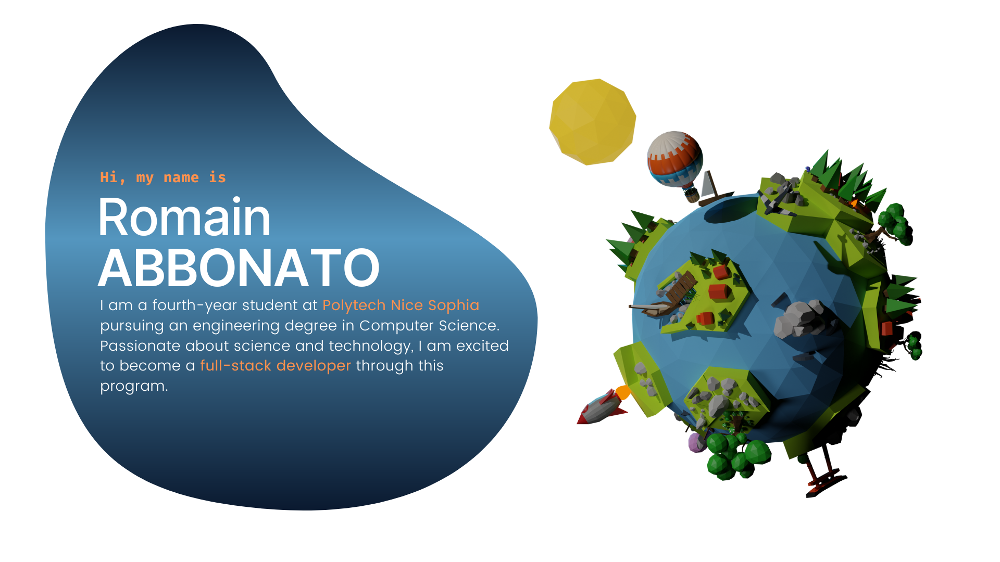

  

  <h3 style="background: rgb(10,25,47);
background: linear-gradient(90deg, rgba(10,25,47,1) 0%, rgba(66,117,157,1) 56%); color: white; padding: 10px 20px; border-radius: 30% 70% 29% 71% / 63% 36% 64% 37% ; display: inline-block; box-shadow: 4px 4px 10px rgba(0, 0, 0, 0.3);">
    Tech Stack
  </h3>

#### Programming Languages
      

#### Frontend Technologies
      

#### Backend Technologies
    

#### Tools & Libraries
  

#### Design & UI Tools
   

#### Video & Animation Tools
  

#### Version Control

  <h3 style="background: rgb(10,25,47);
background: linear-gradient(90deg, rgba(10,25,47,1) 0%, rgba(66,117,157,1) 56%); color: white; padding: 10px 20px; border-radius: 30% 70% 29% 71% / 63% 36% 64% 37% ; display: inline-block; box-shadow: 4px 4px 10px rgba(0, 0, 0, 0.3);">
    GitHub Stats
  </h3>

<table>
  <tr>
    <td valign="middle" style="border: none;">
      
    </td>
    <td valign="middle" style="border: none;">
      
    </td>
  </tr>
</table>

  <h3 style="background: rgb(10,25,47);
background: linear-gradient(90deg, rgba(10,25,47,1) 0%, rgba(66,117,157,1) 56%); color: white; padding: 10px 20px; border-radius: 30% 70% 29% 71% / 63% 36% 64% 37% ; display: inline-block; box-shadow: 4px 4px 10px rgba(0, 0, 0, 0.3);">
    Contact
  </h3>
</div

  
